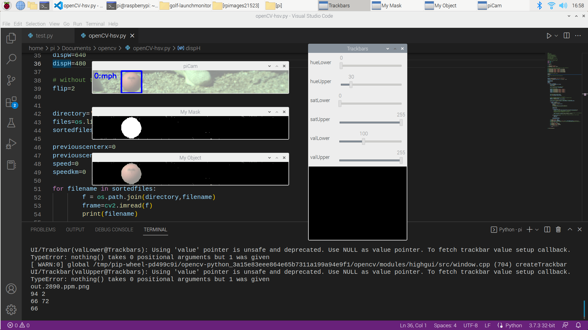
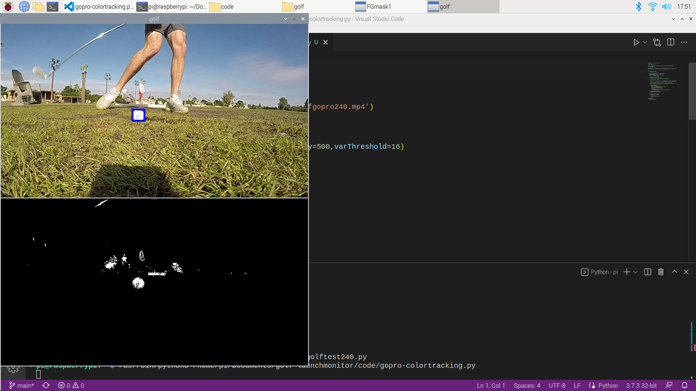
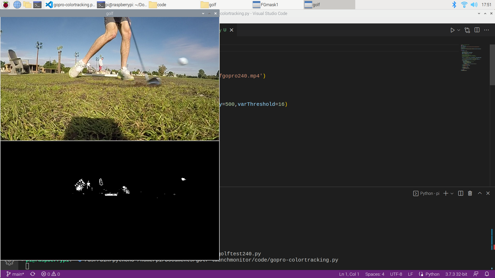

# golf-launchmonitor
Documenting work I've done to try and build a golf ball launch monitor using computer vision and a Raspberry Pi.

## Current State (as of 6/23/23)

## The Journey
I am a golf nut and have always wanted to figure out how I could apply some of my technical skills to a sport I love. Building a launch monitor sounded impossible which made me want to take on the challenge.

Initially started by trying to understand how a golf launch monitor works. Figured out that there are two primary types of launch monitors: camera-based and radar-based. Radar sounded more complicated and potentially less accurate so I decided to go the camera-based route. I started learning about computer vision and object tracking via Paul McWhorter's YouTube series: https://www.youtube.com/@paulmcwhorter

I then started playing with iPhone/GoPro videos and manaully cropping and trying to track the golf ball. My first attempt was simply tracking a white golf ball by color. This seemed to pick up the ball "ok" but it was a manual process. I had to hone in the "whiteness" of the ball on the HSL scale and also specify how big of an area I'd want to consider the golf ball:

